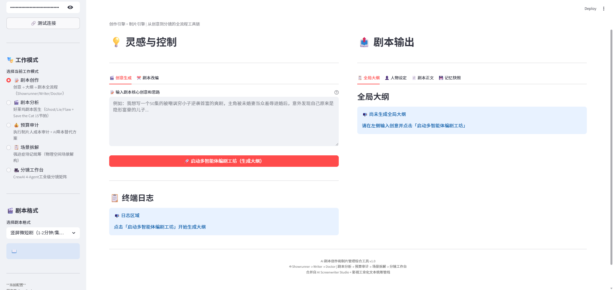
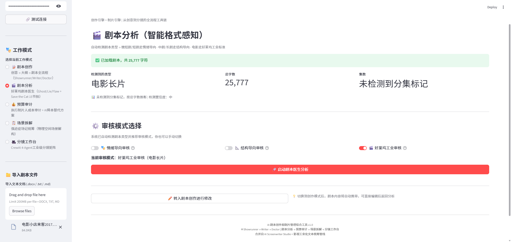
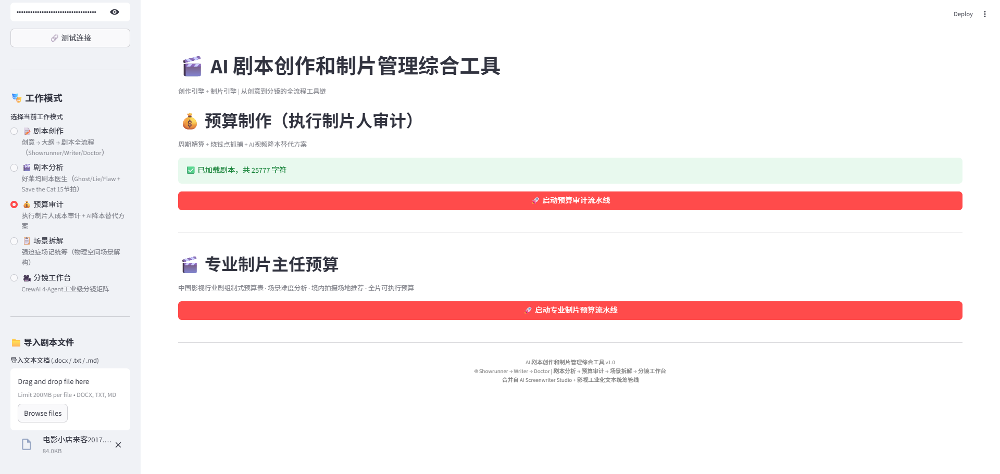
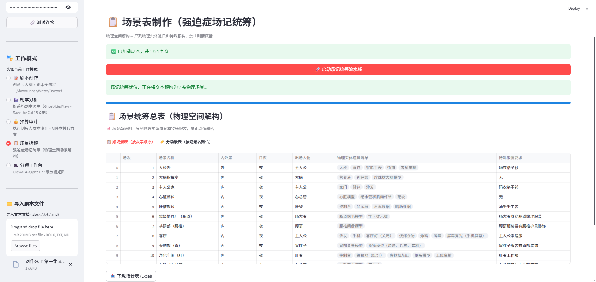
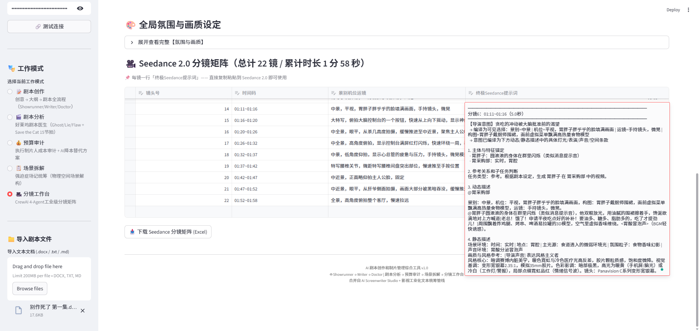

# 🎬 影视创作制片综合工具 (Film Production Toolkit)

**多智能体协同驱动的影视工业化 AI 工作台** — 内置编剧室 SOP、格式感知审核与长文本深度处理，从灵感到分镜一站覆盖。

[English](./README_EN.md) | 中文

---

## 📖 项目简介

影视创作制片综合工具是一个基于多智能体协作的影视工业文本管线，将**剧本创作**与**制片管理**合为一体。系统内置三组专业AI Agent（架构师、编剧、剧本医生）模拟真实编剧室工作流，通过集数级记忆快照与摘要传递机制解决长剧本上下文断裂问题；同时提供剧本分析、预算审计、场景拆解、分镜工作台四大制片模块，实现从创意到分镜的全流程工具链。

### 🎯 核心理念

> **代码 = SOP(团队)** — 把好莱坞编剧室的工业化流程，变成每个人桌上的AI团队。

---

## ✨ 功能亮点

### 📝 剧本创作引擎（3-Agent 协作）

| Agent | 角色 | 职责 |
|-------|------|------|
| 🏗️ Showrunner | 总架构师 | 生成全局大纲、人物小传、规划集数与节奏曲线 |
| ✍️ Writer | 执行编剧 | 按集撰写完整剧本，严格视觉化写作 |
| 🩺 Doctor | 剧本医生 | QA审查、驳回重写、生成记忆快照 |

- **两阶段审批流**：架构师生成大纲 → 用户确认 → 批量生成正文
- **HITL 定向修改**：对大纲/单集剧本提交修改意见，Agent 定向精修而非全盘重写
- **5种剧本格式全覆盖**：竖屏微短剧 / 短剧 / 中剧 / 长剧 / 电影长片

#### 创作工作台界面

左侧「灵感与控制」面板输入核心创意与思路，点击「启动多智能体编剧工坊」后，右侧「剧本输出」区动态生成：

| 输出标签 | 内容 |
|---------|------|
| 🗺️ **全局大纲** | 故事主线、分集梗概、节奏曲线、核心冲突节点 |
| 👤 **人物设定** | 主要角色小传、目标、 Ghost/Lie/Flaw、关系网 |
| 📄 **剧本正文** | 按选定格式生成的完整分集剧本，支持连续创作 |
| 💾 **记忆快照** | 当前创作状态 checkpoint，可随时回滚或继续 |



### 🎬 剧本分析引擎（格式感知双轨审核）

系统根据剧本文本体量**自动识别**剧集类型，并选用差异化审核标准：

| 剧集类型 | 审核导向 | 核心审核标准 |
|---------|---------|------------|
| 微短剧 / 短剧 | 🎭 情绪导向 | 多巴胺节奏、情绪爽感、打脸力度、钩子强度 |
| 中剧 / 长剧 | 📐 结构导向 | 起承转合、逻辑自洽、人物弧光、反转伏笔 |
| 电影长片 | 🎥 好莱坞工业 | Save the Cat 15节拍、Ghost/Lie/Flaw、McKee场景价值翻转 |

#### 智能格式感知界面

导入剧本后，系统顶部自动展示识别结果：

| 识别维度 | 示例输出 |
|---------|---------|
| **检测到的类型** | 电影长片 / 短剧 / 微短剧 / 中剧 / 长剧 |
| **总字数** | 25,777 字符 |
| **集数** | 未检测到分集标记 / 共 N 集 |

#### 审核模式选择

用户可手动切换或接受系统推荐：

| 模式 | 开关 | 适用 |
|------|:---:|:---|
| 🎭 情绪导向审核 |  Toggle | 微短剧 / 短剧 |
| 📐 结构导向审核 |  Toggle | 中剧 / 长剧 |
| 🎥 好莱坞工业审核 |  Toggle | 电影长片 |

点击「启动剧本医生分析」后，Doctor Agent 按当前审核模式输出结构化诊断报告。



### 💰 预算审计引擎

- **执行制片人预算审计**：逐行抓捕烧钱点 + AI降本替代方案
- **专业制片主任预算**：剧组规模/日均费率/逐场景费用明细/场地推荐

#### 预算工作台界面

加载剧本后显示「已加载剧本，共 X 字符」，提供两条独立流水线：

| 流水线 | 按钮 | 输出 |
|--------|------|------|
| **执行制片人审计** | 「启动预算审计流水线」 | 烧钱点清单、AI 降本替代方案、可删减项建议 |
| **专业制片主任预算** | 「启动专业制片预算流水线」 | 中国影视行业剧组制式预算表、场景难度分析、境内拍摄场地推荐、全片可执行预算 |



### 📋 场景拆解引擎

强迫症场记统筹 — 按物理空间解构每场戏，提取道具清单与服装要求。

#### 场景统筹总表（物理空间解构）

点击「启动场记统筹流水线」后，系统将剧本解构为若干物理场景，输出可切换的统筹表格：

| 表格视图 | 排序方式 |
|---------|---------|
| 📜 **顺场表** | 按故事顺序 |
| 🏠 **分场景表** | 按场景名聚合 |

**每行字段示例：**

| 场次 | 场景名称 | 内外景 | 日夜 | 出场人物 | 物理实体道具清单 | 特殊服装要求 |
|:---:|:--------:|:-----:|:----:|:--------:|:----------------:|:------------:|
| 1 | 大楼外 | 外 | 夜 | 主人公 | 大楼、背包、智能手表、街道、零星车辆 | 码农格子衫 |
| 2 | 大脑指挥室 | 内 | 夜 | 大脑 | 营养液、神经线、珍珠状大脑模型 | 无 |
| 3 | 主人公家 | 内 | 夜 | 主人公 | 家门、背包、沙发 | 码农格子衫 |

> 场记原则：只列物理实体道具和特殊服装，禁止剧情概括。

表格支持导出 Excel，可直接交付制片组统筹。



### 🎥 AI 视频分镜提示词引擎（Seedance 2.0 兼容 · 工业级多 Agent 生成）

这不是普通的分镜拆解——我们在底层构建了完整的 **AI 视频生成镜头逻辑体系**，让 LLM 输出的分镜可以直接送入即梦、Kling 等 AI 视频工具，无需人工二次加工。

#### 20 种情境映射引擎（Scenario Mapping）

预定义 20 组工业级情境（E01–E20），每组锁定焦段+光圈+机位+运镜核心组合，避免 AI 自由发挥导致的透视冲突和风格漂移：

| 情境 ID | 典型场景 | 核心组合 |
|--------|---------|---------|
| E01 | 主角觉醒 | 中焦 50-85mm + f/4 + 低角度仰拍中景 + 轨道缓推 |
| E02 | 反派登场 | 广角 24-35mm + f/2.0 + 低角度静态 + 极轻微缓推 |
| E06 | 暴怒爆发 | 广角 + 大光圈 + 手持快摇 |
| E13 | 库布里克式异化 | 强对称居中 + 广角 + 缓推 |
| E15 | 神性顿悟 | 逆光剪影 + 背景过亮解锁 + 缓升 |
| E19 | 物体抛物线追踪 | 中焦 85mm + f/4 + 侧面平视 + 快摇 Catch |

#### 80/15/5 权重机制

| 权重 | 类型 | 约束 |
|------|------|------|
| **80%** | 核心组合（锁死必用） | 来自情境 ID，全部必须用上，不可替换删除 |
| **15%** | 辅助锚点 | 增强情绪细节，选 1–2 项 |
| **5%** | 增强项 | 仅情绪命中点使用，一段戏内最多 1 个镜头 |

#### 6+1 必填分镜字段

每个镜头必须输出 6 个必填字段 + 1 个可选限制字段：

| 字段 | 说明 |
|------|------|
| **焦段** | 超广角 / 广角 / 标准 / 中焦 / 长焦 / 微距 |
| **光圈** | 超大光圈 f/1.2–f/1.8 / 大光圈 f/2.0–f/2.8 / 中等 f/4–f/5.6 / 小光圈 f/8+ |
| **机位** | **5要素模板**：摄影机位置 + 高度 + 拍摄角度 + 主体动作 + 景别 |
| **构图** | 构图法则（三分法/黄金分割/框架式/对角线/留白/对称） + 空间分区内容（前景/左侧/右侧/背景） |
| **运镜** | 中英混合专业术语（Dolly In / Steadicam / 希区柯克变焦 / 手持呼吸感） |
| **主体动作表情** | 台词必须嵌入此行，不另立项 |
| **限制（可选）** | AI 易错点约束（如"不允许出现字幕""服装与上一镜完全一致"） |

#### 5维度视觉连贯性

相邻分镜间强制执行 5 条连贯性规则：

| 维度 | 规则 |
|------|------|
| **A. 180° 轴线** | 对话场景摄影机不越过假想轴线（仪式性越轴除外） |
| **B. 视线匹配** | A 镜角色看右 → B 镜角色从左入画且视线朝左 |
| **C. 动作衔接 60%** | A 镜末尾动作 = B 镜开头动作 60–80% 延续，禁止动作突跳 |
| **D. 道具状态延续** | 同一场景中水杯量 / 烟头长度 / 服装前后一致 |
| **E. 景别跳跃** | 禁止连续 3 镜同景别（同景别连切 = 跳切焦虑感） |

#### 透视屏蔽法则（解决 AI 视频"后脑勺长脸"）

当机位为**背面/过肩/侧后方**时，强制剔除面部表情描写：
- ❌ "皱眉、流泪、怒目、微笑" → ✓ "肩膀颤抖、背部紧绷、握拳"
- ❌ "眼神中燃烧着怒火" → ✓ "双眉紧锁，牙关绷紧，攥紧的拳头微微颤抖"
- 确保 AI 视频模型不会给后脑勺生成面部特征

#### 抽象描述转译引擎

自动将文学化抽象情绪转译为**可拍摄的物理动作**：

| 文学描述 | 转译结果 |
|---------|---------|
| "内心崩溃了" | 手指在桌下捏紧另一只手，呼吸短促但表情维持平静 |
| "燃烧着怒火" | 双眉紧锁，牙关绷紧，攥紧的拳头微微颤抖 |
| "她鼓起勇气" | 吸管搅拌奶茶的动作慢一拍，抬头时机比对方晚 0.5 秒 |

#### 道具物理透视法则

- **物品背面朝镜头**：角色阅读信件时，纸张背面朝向镜头，无文字可见
- **道具降维翻译**："征兵令" → "一张粗糙的纸"；"密信" → "手中一封折叠的信"
- **禁止物体违背物理**：印章面不朝向镜头（除非专门拍物品特写）

#### 文戏/武戏节奏引擎

| 类型 | 运镜风格 | 镜头密度 | 景别 |
|------|---------|---------|------|
| 文戏 | 静态或缓慢运镜 | 每段 1–3 个（稀疏） | 近景/特写为主 |
| 武戏 | 手持快摇 + 快切 | 文戏的 2–3 倍（密集） | 快速交替 |

- 文戏对话：每 2–3 句台词自动插入**反应镜头**，聚焦听者表情变化
- 武戏：景别快速跳跃（特写 → 全景 → 侧拍），制造紧张感

#### 分镜工作台界面

加载剧本并启动 CrewAI 4-Agent 流水线后，工作台输出：

| 区域 | 内容 |
|------|------|
| 🎨 **全局氛围与画质设定** | 可展开查看：风格基调、色彩主题、光影造型、统一画质词，作为整套分镜的视觉圣经 |
| 🎬 **Seedance 2.0 分镜矩阵** | 标准表格：镜头号 / 时间码 / 景别·机位·运镜 / 终极 Seedance 提示词，支持一键下载 Excel |



#### 5列 Seedance 2.0 终极提示词输出

最终输出为标准 JSON 数组，可直接渲染为 DataFrame 表格：

| 列 | 内容 |
|----|------|
| 镜头号 / 时间码 / 景别·机位·运镜（融合描述） / 基本设定标签 |
| **终极 Seedance 提示词** | 一段可直接粘贴至 Seedance 2.0 的完整文本，包含：【导演意图】+【主体与特征锚定】+【参考关系和子任务判断】+【动态描述】+【静态描述】。专业案例级密度，无需人工二次加工 |

#### 🎯 导演意图引擎 `felt_intent`（v4.3 新增）

每个镜头携带独立的导演意图字段，驱动景别、机位、运镜的全局选择——参考 Seedance 2.0 Skill OS `directing-engine` + `felt-intent`：

| 意图类型 | 示例 | 驱动的视觉设置 |
|---------|------|-------------|
| **揭示** | "让观众注意到他手上的伤疤" | 中景 → 特写慢推 + 侧光强调纹理 |
| **压迫** | "让她在画面中显得渺小无助" | 高角度俯拍远景 + 人物与环境的比例失衡 |
| **亲密** | "拉近两人之间未说出口的距离" | 浅景深双人中景 + 缓慢跟焦 + 暖色散射光 |

> "一个揭示不是像告别那样布光、构图、走位、表演的。"——Seedance 2.0 核心理念

#### 🚫 系统化反渣词库 Anti-Slop Lexicon（v4.3 新增）

参照 `anti-slop-lexicon.md`，内建 4 类禁止词汇 + 具体替代指南，Director 和 QA 双轮拦截：

| 类别 | 禁止词示例 | 正确写法 |
|------|-----------|---------|
| **膨胀词** | cinematic, epic, stunning, breathtaking | 给出具体的视觉来源和光影细节 |
| **空助推器** | high quality, masterpiece, 8k, 4k | 描述材质触感、光线方向和画面分辨率成因 |
| **抽象标签** | emotional, beautiful, atmospheric | 列出可见的颜色/光线/动作证据 |
| **模糊词** | 温馨、压抑、暧昧、廉价、恐怖、浪漫 | 转译为光源色温、空间尺度、人物距离 |

#### 🎥 增强镜头·运镜·光影词汇体系（v4.3 新增）

从 Seedance 2.0 `seedance-camera` + `seedance-motion` + `seedance-lighting` 参照文件提取，注入到 Director Agent：

| 词汇类别 | 原数量 | v4.3 | 新增能力 |
|---------|:---:|:---:|---------|
| **景别** | 6 种 | **11 种** | 荷兰角(Dutch Angle)、过肩(OTS)、主观POV、极端特写(ECU)、建立镜头(Establishing) |
| **运镜** | 8 种 | **11 种** | 视差滑动(Parallax Slide)、步进变焦(Dolly Zoom)、反应镜头(Reaction)、发现镜头(Discovery) |
| **机位** | 基础 | **6 种** | 每种标注情感含义（仰拍 = 威严/威胁，俯拍 = 渺小/无力，眼平 = 共情/中性） |
| **光源类型** | — | **6 种** | 主光(Key)、补光(Fill)、边缘光(Rim)、环境光(Ambient)、实用光(Practical)、反射光(Bounce) |
| **色温体系** | — | **4 族** | 冷色(6500K+) / 中性(4500–5500K) / 暖色(2700–3500K) / 极暖(<2000K)，带时间暗示 |

#### 🧠 模型机制注入 Model Mechanics（v4.3.1 新增）

引入 Seedance 2.0 `model-mechanics.md` 的底层原理，让 Agent 不仅知道规则，更理解**为什么规则有效**：

| 机制 | 注入内容 |
|------|---------|
| **保真度预算** | 模型一代分配的保真度有限——别在次要区域消耗过多，集中资源到画面核心 |
| **位置权重** | Prompt 开头权重 > 中间 > 末尾 → 关键特征前置到 Section 1 主体锚定 |
| **能力地图** | 擅长：材质纹理、光影互动、流体运动、微观细节；不擅长：精确文字、手指细节、复杂空间关系 |
| **一致性优先** | 宁愿简化场景保证角色一致性，也不在复杂环境中出现角色漂移 |

#### 🔄 重拍决策协议 Reshoot Protocol（v4.3.1 新增）

QA Agent 从二元"通过/不通过"升级为四级质量分级 + 精准重拍策略：

| 质量等级 | 阈值 | 处理方式 |
|---------|:---:|---------|
| **A 级** | ≥90% | 直接通过，可微调 |
| **B 级** | 80–89% | 通过，标注可改进点供下一轮参考 |
| **C 级** | 60–79% | **单变量重拍**：仅修正最大问题，不动其他维度 |
| **D 级** | <60% | 全部重拍，保留场景定义和角色出场信息 |

- **单变量重拍原则**：一次只改一个维度（光线/构图/动作），避免连锁破坏
- **尝试预算**：每镜最多重拍 2 次，超限则标记人工审核，不会无限循环

#### 📊 事件密度防火墙 Event Density Firewall（v4.3 新增）

QA Agent 内置数学模型自动审查：

```
独立事件数 / 镜头秒数 > 0.5  →  内容过载，强制拆分或延长时长
```

杜绝常见 AI 生成问题：4-5 秒内塞入多个独立动作 + 多次镜头切换。

#### 🔌 多模态引用扩展点（v4.3.1 预留）

预留 `@Image` / `@Video` / `@Audio` 引用语法接口（`_resolve_multimodal_references()` 桩函数），未来接入 I2V / V2V 时无需重构核心分镜逻辑。当前纯文本 T2V 模式下零影响。

---

### 🔧 Harness 工程化层（v0.2.0）

Harness 是一个模块化的工程化中间层，位于 UI 与 Agents Engine 之间，为 3-Agent 剧本创作管线提供生产级的**韧性、记忆与成本控制**能力。所有模块遵循"可选启用、向后兼容、增量增强"设计原则。

#### 6 大核心模块

| 模块 | 解决的问题 | 实际价值 |
|------|----------|---------|
| **CheckpointManager** 断点续传 | 页面刷新/Browser崩溃/断电 → 进度全丢 | 任意时刻保存或恢复，支持按集数间隔自动保存。100集长剧写完不怕中断 |
| **StructuredMemoryStore** 结构化记忆 | 单段长文本记忆 → 50+集后角色性格/位置/伏线严重漂移 | `CharacterState` 精准追踪每个角色的位置/情绪/目标/关系/秘密；`PlotThread` 管理每条伏线生命周期（planted→active→revealed）；`EpisodeIndex` 按集检索摘要 |
| **ContextRetriever** JIT上下文检索 | 每集Writer注入全量上下文（5000+ token起步），集数越多越膨胀 | 单集仅注入最小必要上下文（当前大纲段落 + 前3集摘要 + 活跃角色 + 活跃伏线），**Token 消耗降低 40-60%** |
| **ToolSchema + ToolRegistry** 工具结构化 | 所有Agent能力规则写在prompt长文本里，模型理解不精准 | 按OpenAI function-calling兼容格式定义工具，每个Agent只获得自己需要的工具集，精准注入 |
| **BudgetTracker + TerminationGuard** 预算与终止 | Doctor不满意或API异常时无限循环烧Token | **6层终止守卫**：安全拒绝 → 用户中断 → 自然完成 → 预算超限 → 轮次上限 → 红线违规。单集最多10轮×5000 token=5万token硬上限 |
| **Safety Guardrails** 安全护栏 | Agent生成内容无安全约束 | Writer Prompt五层注入中安全护栏优先级最高，Doctor升级为对抗性审查模式 |

#### 管线关键修复

| 问题（v0.1） | 修复（v0.2） |
|-------------|-------------|
| **Writer重试空转**：Doctor驳回反馈从未传给Writer，凭空重写 | Doctor反馈 + Writer上一稿 真正传入 retry 分支，实现**螺旋式精修** |
| **强制通过集跳过Harness**：force-approve时记忆/角色/checkpoint全不更新 | 补齐全套流程：记忆提取 → 角色状态更新 → checkpoint自动保存 |
| **CheckpointManager重复创建**：同一页面周期3-5次实例化 | `session_state` 单例缓存，全生命周期只创建一次 |
| **分镜串行瓶颈**：Image和Video Prompt必须等前者完成 | 新增 `parallel=True` 模式，Image ∥ Video 并行生成，分镜提速 **30-40%** |

---

- **CrewAI 4-Agent Seedance 2.0 分镜矩阵**：Seedance 分镜导演 → 视觉档案师 → Seedance 提示词工程师 → Seedance 格式质检
- **全局美术风格词**：自定义 StyleTokens，自动追加到每个镜头英文提示词末尾

### 🔄 创作-审核-修改闭环

```
剧本创作 → 一键转入分析 → 差异化审核 → AI一键修改 → 返回分析验证
```

---

## 🆚 与在线LLM（ChatGPT/Claude/豆包等）的核心区别

| 维度 | 在线LLM聊天 | 本工具 |
|------|-----------|-------|
| **工作流** | 单轮对话，需手动管理上下文 | 内置3-Agent流水线：架构师→编剧→医生，自动循环 |
| **专业度** | 通用对话，缺乏行业规范约束 | 嵌入好莱坞工业标准（Save the Cat/Ghost-Lie-Flaw/McKee） |
| **格式适配** | 一套Prompt打天下 | 5种格式×3个Agent=15套专属Prompt动态路由 |
| **质量控制** | 输出即最终，无质检环节 | 医生Agent逐集审核，驳回重写（最多3轮） |
| **长文本处理** | 受Token窗口限制，长剧必断裂遗忘 | 集数级记忆快照 + 摘要传递，万行长剧不断裂、不遗忘 |
| **审核标准** | 无差异，微短剧和电影用同一套 | 格式感知双轨引擎：微短剧重情绪满足，电影重结构逻辑 |
| **HITL人机协作** | 每次修改等于从头重写 | 定向精修：只改用户指出的问题，保留优秀部分 |
| **制片管理** | 无 | 预算审计/场景拆解/分镜矩阵，一条龙 |
| **模型接入** | 绑定单一平台，无选择权 | 12+ 服务商自由切换（国内外云端 API + 本地模型），按需选型 |
| **成本灵活** | 单一计费，长剧成本失控 | 多服务商比价切换 + 本地模型可选，成本自主可控 |
| **工程化韧性** | 无断点续传，崩溃即清空 | Harness CheckpointManager：任意时刻存/取，自动间隔保存 |
| **长剧记忆** | 无结构化机制，剧情前后矛盾 | CharacterState + PlotThread + EpisodeIndex 结构化追踪，100集不失忆 |
| **Token效率** | 全量上下文注入，线性增长 | JIT ContextRetriever：按需注入最小必要上下文，节省 40-60% |
| **安全守护** | 内容生成无约束 | Safety Guardrails 最高优先级注入 + 6层终止守卫防止无限烧Token |

### 🔑 一句话总结优势

> **在线LLM是"通用对话"，本工具是"多智能体编剧室"——它不是在聊天，而是在执行影视工业化SOP。**

---

## 🛠️ 技术栈

| 组件 | 技术 |
|------|------|
| Web框架 | [Streamlit](https://streamlit.io/) |
| LLM调用 | OpenAI SDK（兼容多服务商API） |
| 分镜Agent | [CrewAI](https://github.com/crewAIInc/crewAI)（可选） |
| 数据渲染 | Pandas DataFrame + st.data_editor |
| 文件解析 | python-docx |

### 支持的LLM服务商

| 国内 | 海外 | 本地 |
|------|------|------|
| DeepSeek | OpenAI (GPT-4o) | Ollama |
| 硅基流动 SiliconFlow | Claude (Anthropic) | |
| 阿里通义 Qwen | Gemini (Google) | |
| Kimi (Moonshot) | Groq | |
| GLM (智谱) | Mistral | |
| 零一万物 Yi | | |

---

## 🚀 快速开始

### 环境要求

- Python 3.10+
- pip
- （可选）Ollama 本地运行环境

### 方式一：一键部署脚本（推荐）

#### Windows

双击 `setup_and_run.bat` 或在项目目录下执行：

```cmd
setup_and_run.bat
```

脚本将自动：检测Python版本 → 安装依赖 → 启动应用 → 自动打开浏览器。

#### macOS / Linux

由于本项目在 Windows 环境下开发，macOS 的启动脚本可能不如原生环境便捷。请按以下步骤手动部署：

```bash
# 1. 克隆仓库
git clone https://github.com/slipknot0130/Film-Production-Toolkit.git
cd Film-Production-Toolkit

# 2. 创建虚拟环境（推荐）
python3 -m venv venv
source venv/bin/activate

# 3. 安装依赖
pip install -r requirements.txt

# 4. 启动应用
python start.py
```

浏览器将自动打开 `http://localhost:8501`。

> 💡 **macOS用户注意**：如需使用分镜工作台的 CrewAI 功能，需额外安装：
> ```bash
> pip install crewai langchain-openai
> ```

### 方式二：手动安装

```bash
# 1. 克隆仓库
git clone https://github.com/slipknot0130/Film-Production-Toolkit.git
cd Film-Production-Toolkit

# 2. 安装依赖
pip install -r requirements.txt

# 3. 启动
python start.py
```

### 配置API

1. 在侧边栏选择 LLM 服务商
2. 输入对应的 Base URL 和 API Key
3. 点击「测试连接」验证
4. 开始使用！

如使用本地 Ollama，确保 Ollama 服务已启动，工具将自动检测已安装的模型。

---

## 📁 项目结构

```
Film-Production-Toolkit/
├── app.py                    # 主入口，侧边栏 + 模式路由
├── start.py                 # 启动器（自动检测依赖+端口）
├── setup_and_run.bat        # Windows 一键部署脚本
├── requirements.txt         # Python依赖
├── .env.example             # 环境变量模板（API Key等）
├── StyleTokens.txt          # 全局美术风格词（分镜用）
│
├── assets/                   # 📸 界面截图与静态资源
│   └── images/               # README 展示截图
│
├── harness/                  # 🔧 Harness 工程化层（v0.2.0）
│   ├── __init__.py           # 模块入口，版本号 v0.2.0
│   ├── checkpoint.py         # CheckpointManager 断点续传 + WorkflowContext 状态封装
│   ├── memory_store.py       # StructuredMemoryStore 结构化记忆（角色/伏线/集索引）
│   ├── context_retriever.py  # JIT上下文检索，Token消耗降低40-60%
│   ├── tool_schema.py        # ToolSchema/ToolRegistry，Agent能力结构化
│   ├── termination.py        # BudgetTracker + TerminationGuard 六层终止守卫
│   └── config.py             # 统一配置管理
│
├── creator/                 # 🎬 创作引擎
│   ├── agents_engine.py     # 多智能体协作核心（Showrunner/Writer/Doctor）
│   └── ui_creator.py        # 创作流UI + 跨模式桥接
│
├── production/              # 🎥 制片引擎
│   ├── analysis_engine.py   # 格式感知双轨分析（情绪/结构/电影）
│   ├── crew_storyboard.py   # CrewAI 4-Agent分镜模块
│   ├── llm_utils.py         # LLM工具函数（JSON强制输出+自动重试）
│   └── ui_production.py     # 制片流UI（分析/预算/场景/分镜）
│
└── shared/                  # 🔧 共享层
    ├── llm_config.py        # LLM服务商配置 + 动态Prompt路由引擎
    └── session.py           # Session State命名空间管理
```

---

## 🎮 工作模式

| 模式 | 功能 | 适用场景 |
|------|------|---------|
| 📝 剧本创作 | 3-Agent全流程创作 | 从零开始写剧本 |
| 🎬 剧本分析 | 格式感知双轨审核 | 审查已有剧本质量 |
| 💰 预算审计 | 执行制片人成本精算 | 评估制作预算 |
| 📋 场景拆解 | 物理空间场景解构 | 统筹场记/道具清单 |
| 🎥 分镜工作台 | CrewAI 4-Agent分镜矩阵 | 生成工业级分镜 |

---

## 📜 License

MIT License

---

## 🙏 致谢

- [Streamlit](https://streamlit.io/) — 优雅的Web应用框架
- [CrewAI](https://github.com/crewAIInc/crewAI) — 多智能体协作框架
- [OpenAI](https://openai.com/) — LLM API 生态
- [Ollama](https://ollama.ai/) — 本地LLM运行时
- [Save the Cat](https://savethecat.com/) — 剧本结构理论
- [Robert McKee](https://en.wikipedia.org/wiki/Robert_McKee) — 故事价值转变理论
